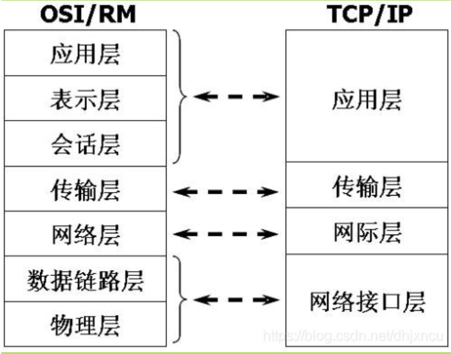

# 网络基础

### OSI七层模型


TCP/IP 参考模型：



### OkHttp主流程


```java
realCall.enqueue(new Callback()
    // enqueue 只允许调用一次
    synchronized (this) {
      if (executed) throw new IllegalStateException("Already Executed");
      executed = true;
    }

    // 拿到调度器执行dispatcher.enqueue方法，
    client.dispatcher().enqueue(new AsyncCall(responseCallback));

    // 调用到 dispatcher的方法
    synchronized void enqueue(AsyncCall call) {
        if (runningAsyncCalls.size() < maxRequests && runningCallsForHost(call) < maxRequestsPerHost) {
          runningAsyncCalls.add(call);
          executorService().execute(call);
        } else {
          readyAsyncCalls.add(call);
        }
      }

      Dispatcher {

         // 等待执行队列
         private final Deque<AsyncCall> readyAsyncCalls = new ArrayDeque<>();

         // 正在运行的队列
         private final Deque<AsyncCall> runningAsyncCalls = new ArrayDeque<>();

         synchronized void enqueue(AsyncCall call) {

             // 如果同时运行的异步任务小于64 && 同时访问(同一个)服务器的请求数 小于5个 ----> 把运行的任务加入到 运行队列中 然后执行
             if (runningAsyncCalls.size() < maxRequests && runningCallsForHost(call) < maxRequestsPerHost) {
               runningAsyncCalls.add(call);
               executorService().execute(call); // 线程池执行耗时操作
             } else {
               // 加入到等待队列
               readyAsyncCalls.add(call);
             }
           }
           

           // 接下来AsyncCall 执行耗时任务
           // 异常的责任划分
           //  responseCallback true：这个错误是用户造成的，和OKHTTP没关系
           //                   false：这个错误是OKHTTP造成的， onFailure
      }
```

   **总结**:

OKHttpClient ---> Request --> newCall RealCall.enqueue(){不能重复执行} ---> Dispatcher.enqueue(AsyncCall) --->

Dispatcher {if:先加入运行队列里面去 执行异步任务 else 直接加入等待队列} --->异步任务 ---> AsyncCall execute{} --->
责任链模式 多个拦截器 response -->

---
**分析OKHTTP里面的线程池**

```
executorService().execute(call);

  public synchronized ExecutorService executorService() {
    if (executorService == null) {
      executorService = new ThreadPoolExecutor(0, Integer.MAX_VALUE, 60, TimeUnit.SECONDS,
          new SynchronousQueue<Runnable>(), Util.threadFactory("OkHttp Dispatcher", false));
    }
    return executorService;
  }
```

* 分析结果：OKHTTP里面的线程池，采用的是缓存线程池方案 + 线程工厂
* 缓存方案：参数1 == 0
  参数2 Integer.Max
  参数3/4：60s闲置时间 只要参数1 ,只要Runnable > 参数1 起作用(60s之内 就会复用之前的任务，60s之后就会回收任务)


### 关于线程池

>Executor 顶层父类

>>ExecutorService

>>>AbstractExecutorService

>>>>ThreadPoolExecutor

* 参数介绍

```java
        /**
        * 
         * 创建线程池
         * 
         * todo 参数一：corePoolSize 核心线程数
         * todo 参数二：maximumPoolSize 线程池非核心线程数 线程池规定大小
         * todo 参数三/四：时间数值keepAliveTime， 单位：时分秒  60s
         *                正在执行的任务Runnable20 < corePoolSize --> 参数三/参数四 才会起作用
         *                作用：Runnable1执行完毕后 闲置60s，如果过了闲置60s,会回收掉Runnable1任务,，如果在闲置时间60s 复用此线程Runnable1
         *
         * todo 参数五：workQueue队列 ：会把超出的任务加入到队列中 缓存起来
         *
         */
         ExecutorService executorService =
               new ThreadPoolExecutor(1, 1, 60, TimeUnit.SECONDS, new LinkedBlockingDeque<Runnable>());
```

Java设计者 考虑到了不用使用线程池的参数配置，提供了API：
1. 带缓存复用的线程池

```java

  ExecutorService executorService = Executors.newCachedThreadPool(); // 缓存线程池方案
        executorService1.execute(new Runnable() {
            @Override
            public void run() {
            }
        });
```
      以上代码等价于下面代码：
```java
         ExecutorService executorService =
                new ThreadPoolExecutor(0, Integer.MAX_VALUE, 60, TimeUnit.SECONDS, new SynchronousQueue<Runnable>(),
                        new ThreadFactory() {
                            @Override
                            public Thread newThread(Runnable r) {
                                Thread thread = new Thread();
                                thread.setName("MyOkHttp Dispatcher");
                                thread.setDaemon(false); // 不是守护线程
                                return thread;
                            }
                        });

        for (int i = 0; i < 20; i++) { // 循环第二次 闲置60s, 复用上一个任务
            executorService.execute(new Runnable() {
                @Override
                public void run() {
                    try {
                        Thread.sleep(1000);
                        System.out.println("当前线程，执行耗时任务，线程是：" + Thread.currentThread().getName());
                    } catch (InterruptedException e) {
                        e.printStackTrace();
                    }
                }
            });
        }
```
2. 线程池里面只有一个 核心线程 最大线程数 也只有一个
```java
       ExecutorService executorService = Executors.newSingleThreadExecutor(); // 单任务线程池
        executorService1.execute(new Runnable() {
            @Override
            public void run() {
            }
        });
```

等价于下面参数设置的线程池：
```java
ExecutorService executorService =
               new ThreadPoolExecutor(1, 1, 60, TimeUnit.SECONDS, new LinkedBlockingDeque<Runnable>());
```

3. 核心线程数固定的线程池

```java
        ExecutorService executorService = Executors.newFixedThreadPool(5); // 指定固定大小线程池
            executorService1.execute(new Runnable() {
               @Override
               public void run() {
              }
           });
```

等价设置：

```java
        ExecutorService executorService =
               new ThreadPoolExecutor(5, 5, 60, TimeUnit.SECONDS, new LinkedBlockingDeque<Runnable>());
```

### OkHttp中的责任链模式


责任链模式
最终返回结果 Response
```java
Response getResponseWithInterceptorChain() throws IOException {
    // Build a full stack of interceptors.
    List<Interceptor> interceptors = new ArrayList<>();
    interceptors.addAll(client.interceptors());
    interceptors.add(retryAndFollowUpInterceptor);
    interceptors.add(new BridgeInterceptor(client.cookieJar()));
    interceptors.add(new CacheInterceptor(client.internalCache()));
    interceptors.add(new ConnectInterceptor(client));
    if (!forWebSocket) {
      interceptors.addAll(client.networkInterceptors());
    }
    interceptors.add(new CallServerInterceptor(forWebSocket));

    Interceptor.Chain chain = new RealInterceptorChain(interceptors, null, null, null, 0,
        originalRequest, this, eventListener, client.connectTimeoutMillis(),
        client.readTimeoutMillis(), client.writeTimeoutMillis());

    return chain.proceed(originalRequest);
  }
}
```


